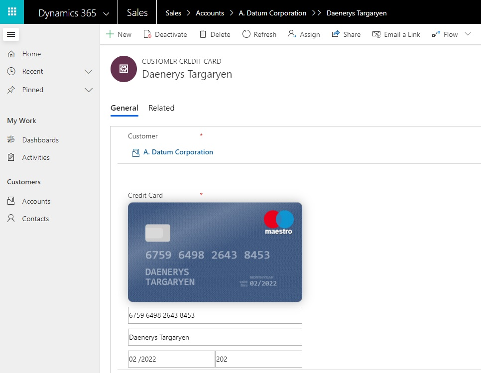
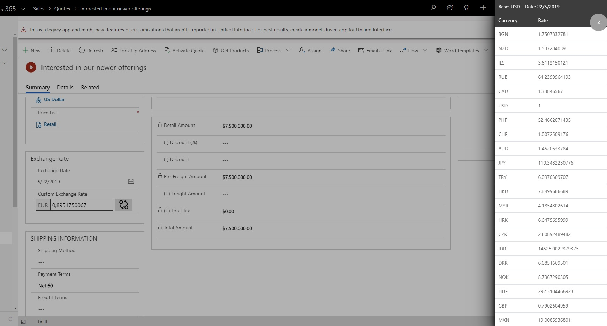
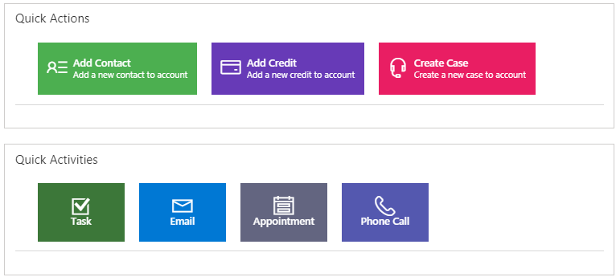
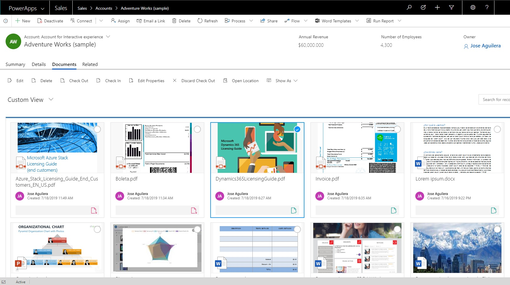

# Power Apps CDS KitControls

This is a project with custom components for D365 CE and Model Driven Apps.  I hope progressively update with new controls. 

# Custom Controls

Here are the custom controls currently included in the project.

Pic |  Control |  Type | Description | Managed Solution
----------------------- | ----------- | -------| ----------- | -----------
 | [Rich Text Control](src/RichTextControl) | Field | A control that let you to write rich text for multiline fields | [RichTextControl](src/RichTextControl/solution/RichTextControl.zip)
 | [Credit Card Control](src/CreditCardControl) | Field | A interactive control for credit card | [CreditCardControl](src/CreditCardControl/solution/CreditCardControl.zip)
 | [Exchange Rate Control](src/ExchangeRateControl) | Field | A control for get the exchange rates from the api https://exchangeratesapi.io/ | [ExchangeRateControl](src/ExchangeRateControl/solution/ExchangeRateControl.zip)
 | [ShortcutButtons](src/ShortcutButtons) | Field | It allows to create shortcut button for open quick forms or main forms of others entities  | [ShortcutButtons](src/DS_SharePointDataCard/solution/DS_SharePointDataCardSolution.zip)
 | [ItemsComparator ](src/DSItemsComparator) | DataSet | Allows comparing selected records through a radar, line or bar chart. | [ItemsComparator](src/DSItemsComparator/solution/DSItemsComparator.zip)
 | [SharePointDocumentCard](src/DS_SharePointDataCard) | DataSet | It allows you to show a preview of the documents in the form of a card | [SharePointDocumentCard](src/DS_SharePointDataCard/solution/DS_SharePointDataCardSolution.zip)

For more info you can to go my page: [https://jaguil3ra.com](https://jaguil3ra.com)

