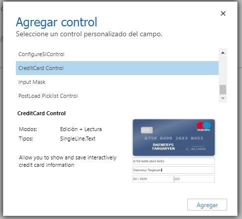

# Credit Card Control

This is a custom control that use the plugin [Card](https://github.com/jessepollak/card) for show a interative Credit Card

# Preparing Solution

1. `npm install`
2. After you need to go to the file path `\node_modulos\card\lib\card.js` and remove the line where is "`require('./card.css')`"
2. npm start

# How Use in D365 CE/PowerApps CDS Form

This control is composed for 4 single line fields in the PowerApps's form which are described below

- A main field for Credit Card Number
- A field for Full Name (it must be hide)
- A field for Expirate Date (it must be hide)
- A field for CVC (it must be hide)

The hidden fields are needed because the values will not be linked in the custom control if they aren't present in the PowerApps form. (I hope that in a future the PCF improve in this regard)

*Download managed solution ready for install **[here](solution/CreditCardControl.zip)***

For more info you can to go my page: [https://jaguil3ra.com](https://jaguil3ra.com)

