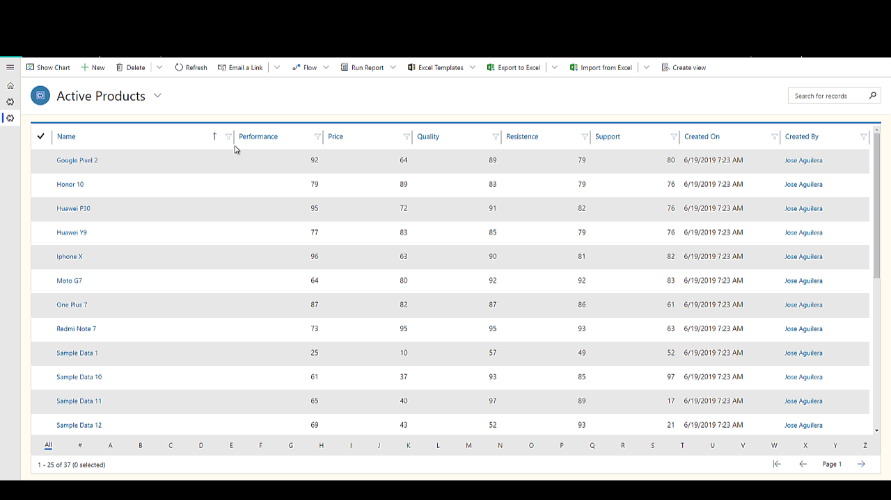
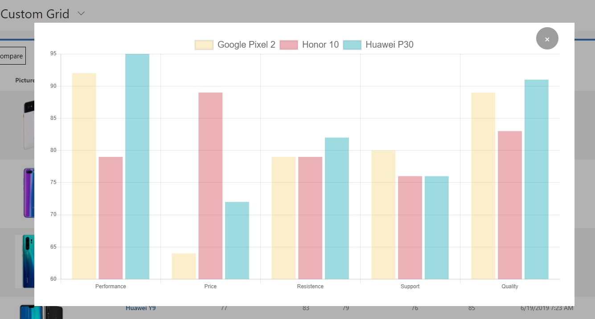
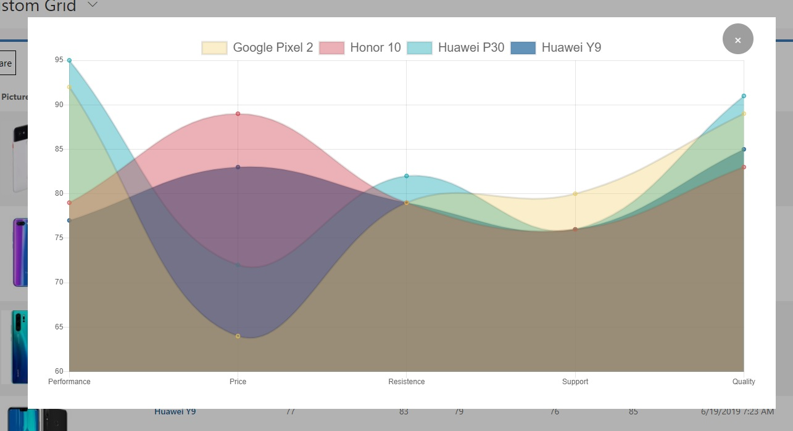

# Items Comparator

This is a custom control for DataSet. Allows comparing records through the charts of radar, bar or line.  Also Allows  enable to view the image of the records in the grid. 

This control was created using [Knockout JS](https://knockoutjs.com/) and [Chart JS](https://www.chartjs.org)  

# How use in D365 CE/ Model Driven View

The control needs a property that identifies the record (name) and at least three numerical properties to compare. All properties must be available in the view

*Download managed solution ready for install **[here](solution/DSItemsComparator.zip)***

For more info you can to go my page: [https://jaguil3ra.com](https://jaguil3ra.com)