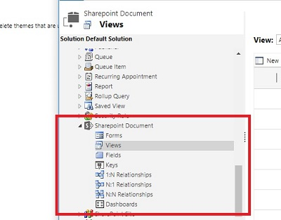
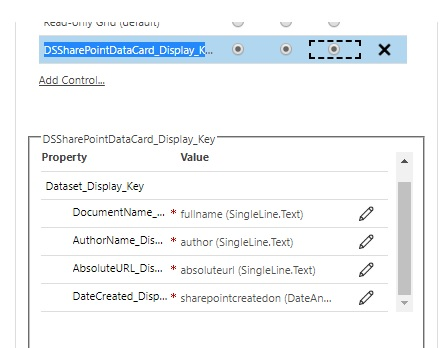

# SharePoint DocumentCard for D365 CE and the Model Driven Apps

This is a custom control for DataSet. The viewer work with SharePoint and OneDrive documents that are associated with entity records

This control uses [office fabric controls](https://developer.microsoft.com/en-us/fabric#/controls/web) 

# How use in D365 CE/ Model Driven View

You need clone the view "All SharePoint Document" (Save as) in the **SharePointDocument** entity.

The view must show the columns: fullname, author, absoluteurl, sharepointcreatedon and also use this configuration in the control:

*Download managed solution ready for install **[here](solution/DS_SharePointDataCardSolution.zip)***

For more info you can to go my page: [https://jaguil3ra.com](https://jaguil3ra.com)